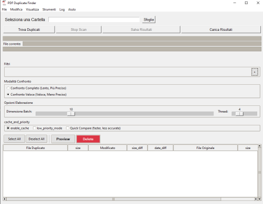

# PDF Duplicate Finder

[](https://github.com/Nsfr750/PDF_finder/releases/latest)
[](https://www.python.org/)
[](https://www.gnu.org/licenses/gpl-3.0)
[](https://github.com/Nsfr750/PDF_finder/graphs/commit-activity)
[](https://github.com/psf/black)
[](https://github.com/Nsfr750/PDF_finder/actions)
[](https://codecov.io/gh/Nsfr750/PDF_finder)



A Python application that helps you find and remove duplicate PDF files based on their content. Features an advanced preview system that allows you to verify duplicates before deletion, with a customizable interface that includes light and dark themes.

## ✨ Features

- **Smart PDF Comparison**: Find duplicate PDFs using content-based analysis
- **Preview System**: Verify potential duplicates side by side before taking action
- **Modern UI**: Clean, intuitive interface with light and dark theme support
- **Multi-language Support**: Built-in internationalization for multiple languages with easy switching
- **Safe Deletion**: Move files to trash instead of permanent deletion
- **Batch Processing**: Handle multiple PDFs efficiently
- **Portable**: No installation required, runs directly from source
- **Enhanced Help System**: Contextual help with multi-language support
- **Settings Management**: Save and restore application preferences

## 🚀 Getting Started

### Prerequisites

- Python 3.8 or higher
- Tesseract OCR (for text extraction from scanned PDFs)
- Poppler (for PDF to image conversion)

### Installation

1. Clone the repository:

   ```bash
   git clone https://github.com/Nsfr750/PDF_Finder.git
   cd PDF_Finder
   ```

2. Create and activate a virtual environment:

   ```bash
   python -m venv venv
   .\venv\Scripts\activate  # Windows
   source venv/bin/activate  # Linux/Mac
   ```

3. Install dependencies:

   ```bash
   pip install -r requirements.txt
   ```

### Usage

1. Run the application:

   ```bash
   python main.py
   ```

2. Click "Scan Folder" to select a directory containing PDF files
3. Review the detected duplicates
4. Use the preview feature to verify duplicates
5. Select files to delete or mark as originals

## 📄 License

This project is licensed under the GPL-3.0 License - see the [LICENSE](LICENSE) file for details.

## 🤝 Contributing

Contributions are welcome! Please feel free to submit a Pull Request.

## 📧 Contact

For any questions or suggestions, please open an issue on GitHub.
