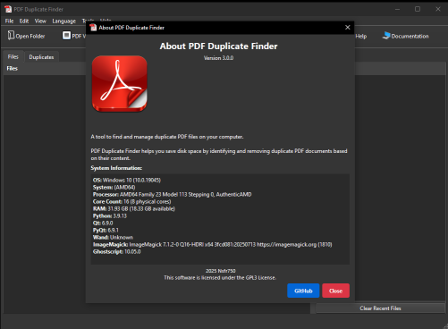

# PDF Duplicate Finder

[](https://www.gnu.org/licenses/gpl-3.0)
[](https://www.python.org/downloads/)
[](https://github.com/psf/black)
[](https://github.com/Nsfr750/PDF_finder/releases)

A powerful tool to find and manage duplicate PDF files on your computer. PDF Duplicate Finder helps you identify and remove duplicate PDF documents, saving disk space and organizing your files more efficiently.



## ✨ Features

- 🔍 **Smart PDF Comparison**: Find duplicate PDFs based on content, not just file names or sizes
- 📝 **Text-based Comparison**: Identify duplicates even with minor visual differences using advanced text analysis
- 👁 **Built-in PDF Viewer**: Preview PDFs directly within the application
- 📋 **Dual-View Interface**: View both file list and duplicates groups in separate tabs
- 🎯 **Advanced Filtering**: Filter by file size, modification date, and name patterns
- 🚀 **Fast Scanning**: Optimized algorithms for quick scanning of large PDF collections
- 🎨 **Intuitive UI**: Clean and user-friendly interface with light/dark theme support
- 🔄 **Batch Processing**: Process multiple files or entire folders at once
- 📊 **Detailed Analysis**: View file details, previews, and comparison results
- 🛠 **Advanced Tools**: Multiple selection modes, filtering, and sorting options
- 🌍 **Enhanced Multi-language Support**: Completely rewritten translation system using Python modules for better performance and maintainability
- 📊 **Progress Tracking**: Real-time progress bar for file processing operations
- ⏱ **Recent Files**: Quick access to recently opened files with context menu options
- 🐛 **Enhanced Stability**: Major bug fixes including duplicate tree population, PDF viewer issues, and signal handling improvements

## 🆕 What's New in Version 3.0.0

### Major Improvements

- **Completely Rewritten Translation System**: Migrated from JSON files to Python modules for better performance, maintainability, and error handling
- **Critical Bug Fixes**: Resolved major issues that were affecting user experience and application stability
- **Enhanced UI Stability**: Fixed toolbar shifting, duplicate signal connections, and tree population issues
- **Improved Error Handling**: Better handling of QPainter errors and system-level Qt issues

### Key Bug Fixes

- **Fixed Duplicates Tree Population**: Resolved issue where size, modified, and similarity columns were not being populated correctly
- **Fixed PDF Viewer Double-Click Bug**: Eliminated problem where double-clicking opened 3 PDF viewers instead of 1
- **Fixed Toolbar Shifting**: Resolved UI layout issues during language changes
- **Fixed Translation System**: Eliminated "Translation key not found" errors and improved language switching
- **Fixed Signal Handling**: Resolved duplicate signal connections that were causing multiple handler executions

## 📦 Installation

### Prerequisites

- Python 3.8 or higher
- pip (Python package manager)
- Optional backends for PDF rendering (Auto falls back safely):
  - PyMuPDF (fitz) — default and bundled via requirements
  - Ghostscript (for Wand) — install Ghostscript and set its executable path in Settings

See [PREREQUISITES.md](PREREQUISITES.md) for platform-specific setup.

### Install from source

1. Clone the repository:

   ```bash
   git clone https://github.com/Nsfr750/PDF_finder.git
   cd PDF_finder
   ```

2. Create and activate a virtual environment (recommended):

   ```bash
   python -m venv venv
   .\venv\Scripts\activate  # Windows
   source venv/bin/activate  # Linux/Mac
   ```

3. Install the required dependencies:

   ```bash
   pip install -r requirements.txt
   ```

## Usage

1. Launch the application:

   ```bash
   python main.py
   ```

2. Click "Scan Folder" to select a directory to scan for duplicate PDFs.

3. Review the results in the main window. After a scan completes, the file list is automatically populated with the scanned PDFs and duplicate groups.

4. Use the tools to manage duplicates:
   - Mark files to keep
   - Delete unwanted duplicates
   - Preview files before taking action

## Key Features in Detail

### Smart PDF Comparison

- Compares PDF content using advanced hashing algorithms
- Detects similar documents even with different file names or metadata
- Configurable similarity threshold for fine-tuned results

### Enhanced Translation System (v3.0.0)

- Completely rewritten using Python modules instead of JSON files
- Improved performance and maintainability
- Better error handling and fallback mechanisms
- Support for dynamic language switching without application restart

### Performance Optimizations

- Multi-threaded scanning for faster processing
- Memory-efficient handling of large PDF files
- Progress tracking and cancellation support
- Optimized translation loading for better startup performance

### User Experience

- Modern, responsive interface with enhanced stability
- Customizable view options with improved layout handling
- Comprehensive keyboard shortcuts
- Detailed file information and previews
- Better error handling and user feedback

## Version History

See [CHANGELOG.md](CHANGELOG.md) for a complete list of changes in each version.

## Contributing

Contributions are welcome! Please read our [Contributing Guidelines](CONTRIBUTING.md) for details on how to contribute to this project.

## 📄 License

This project is licensed under the GNU General Public License v3.0 - see the [LICENSE](LICENSE) file for details.

## 🙏 Acknowledgments

- Thanks to all contributors who have helped improve PDF Duplicate Finder
- Built with ❤️ using Python and PyQt6

## 🐞 Known Bugs

- None known at this time

---

📅 **Last Updated**: March 2025  
🐍 **Python Version**: 3.8+  
📜 **License**: GPL-3.0
